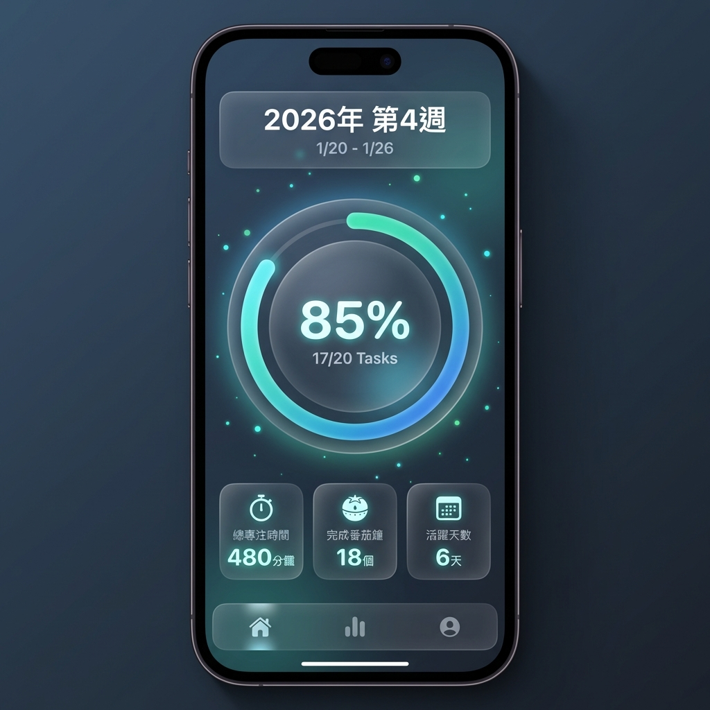
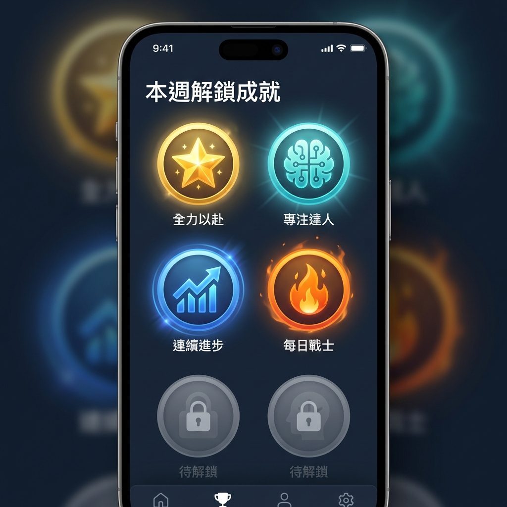
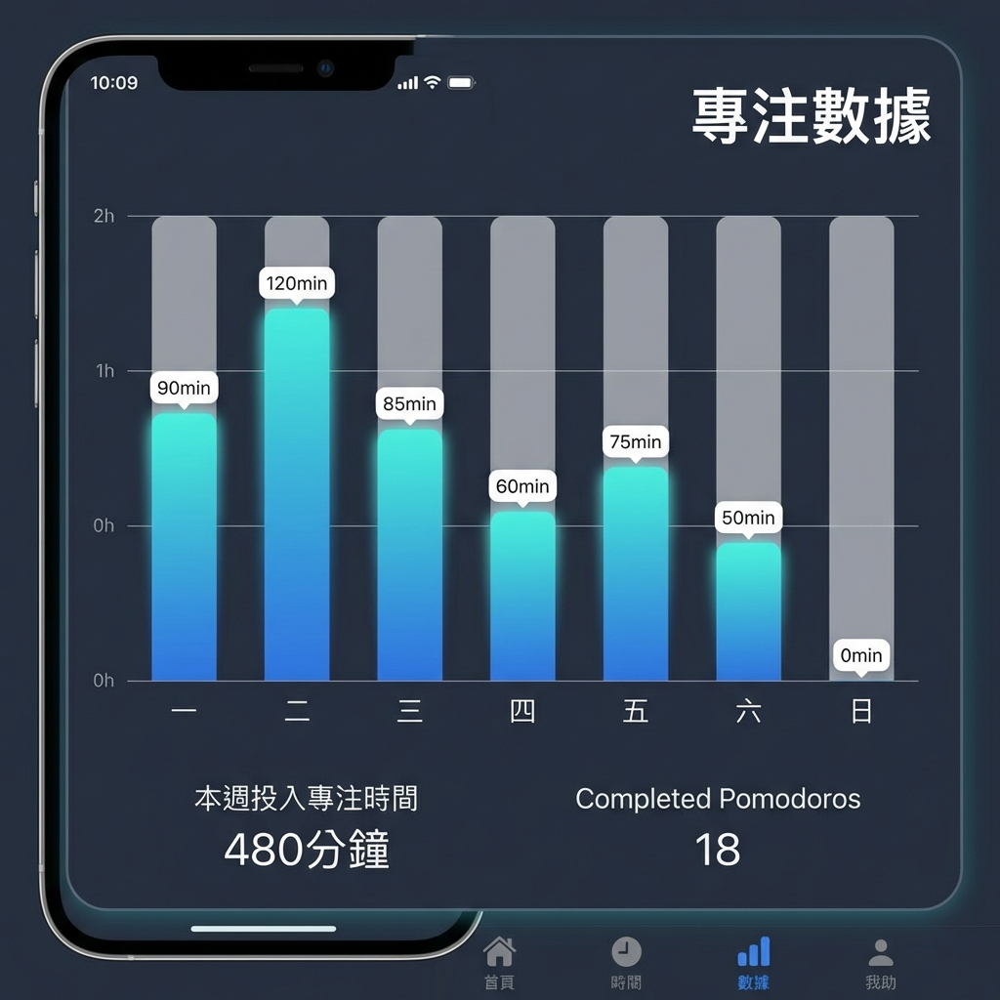
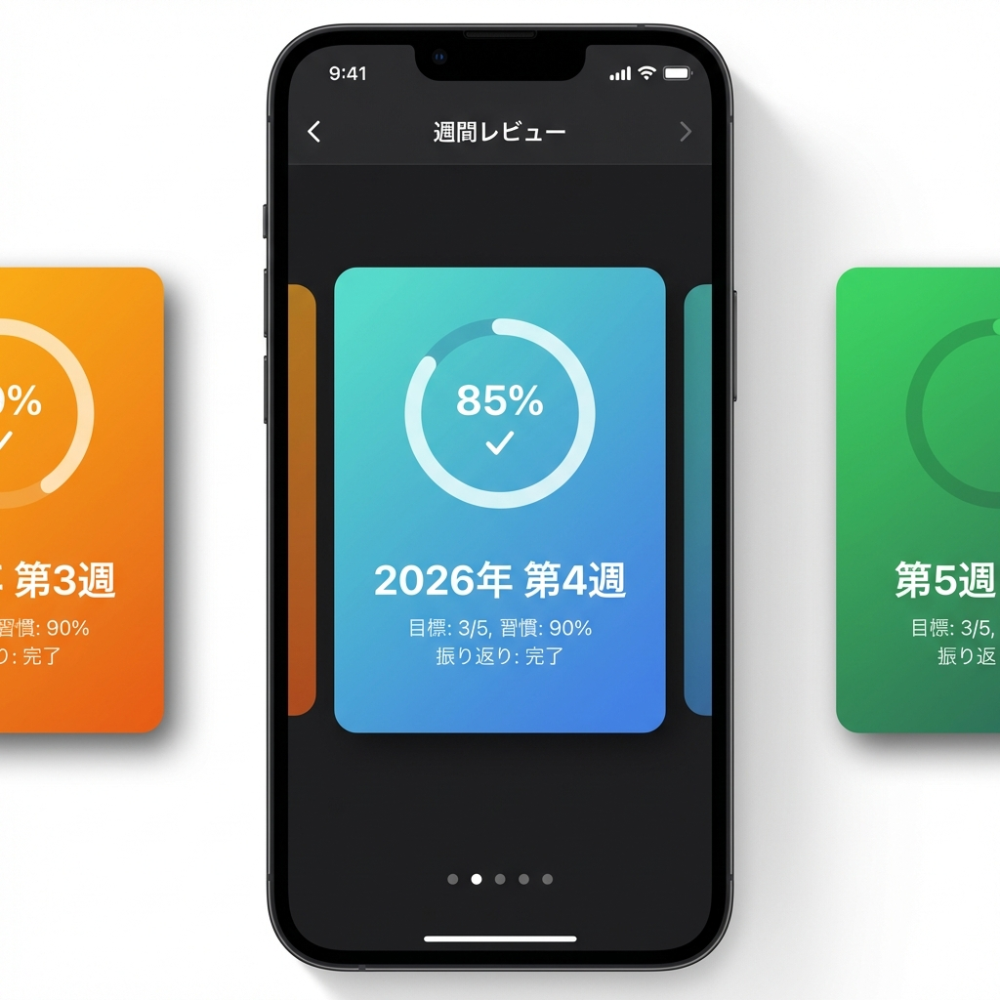
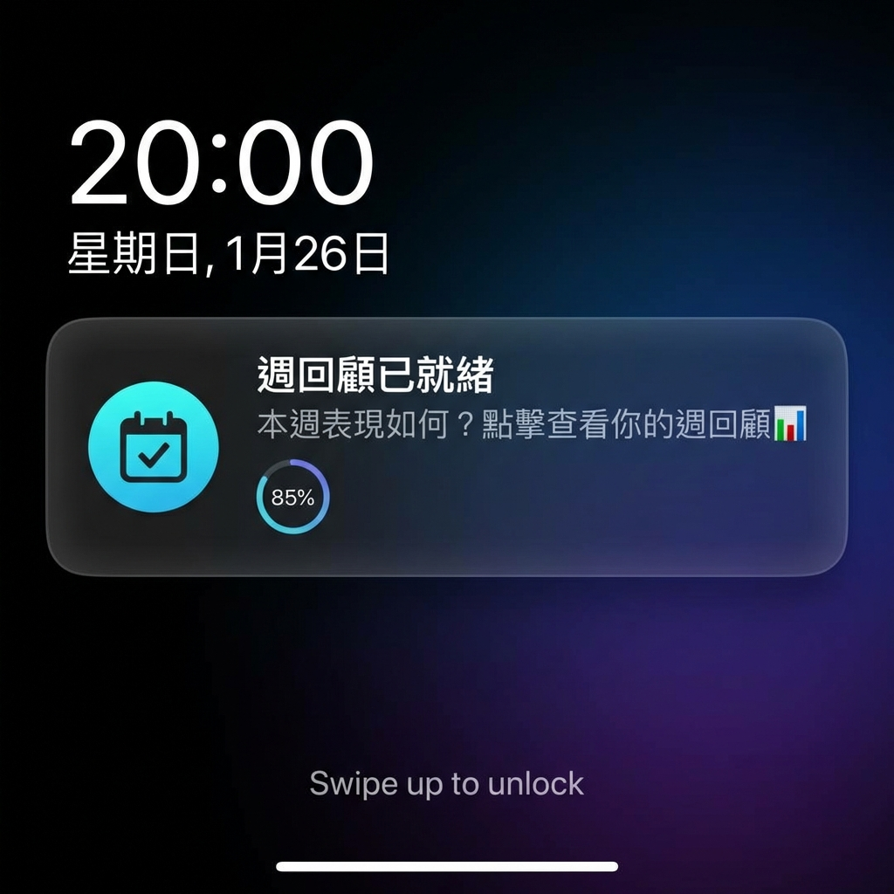
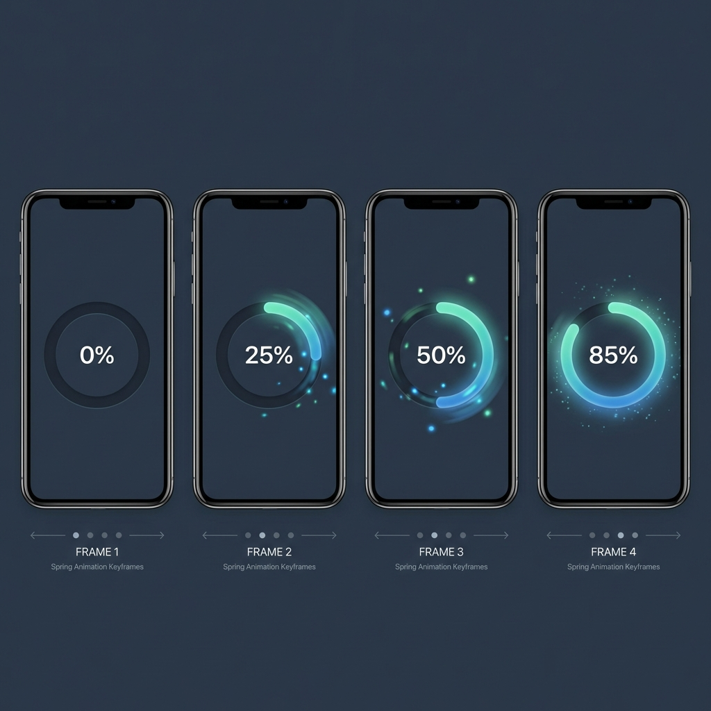
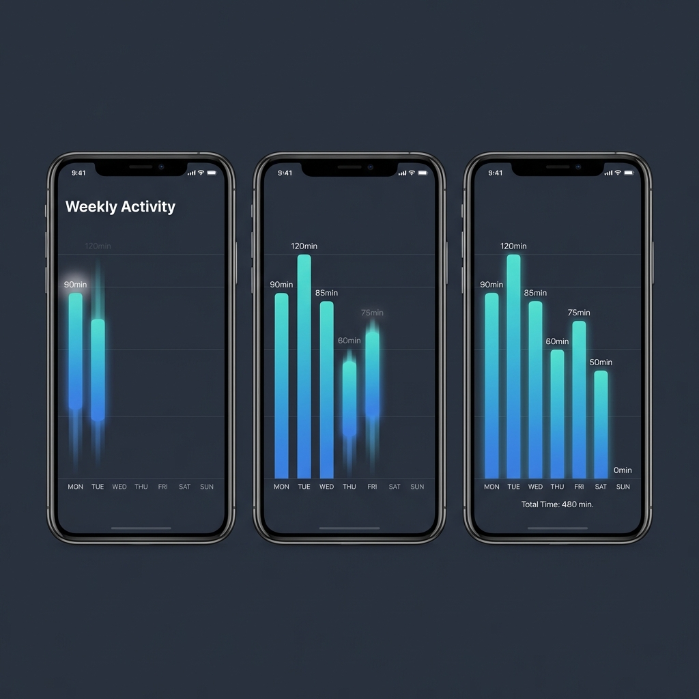
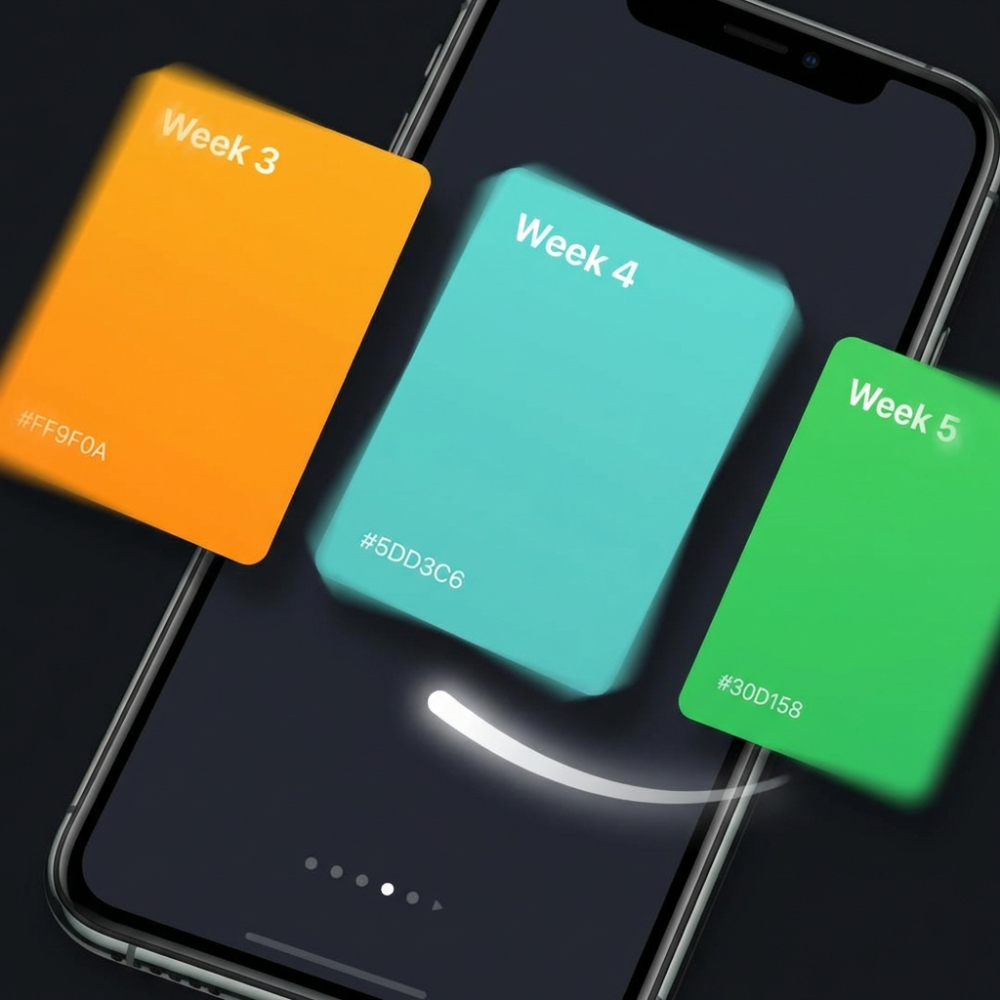
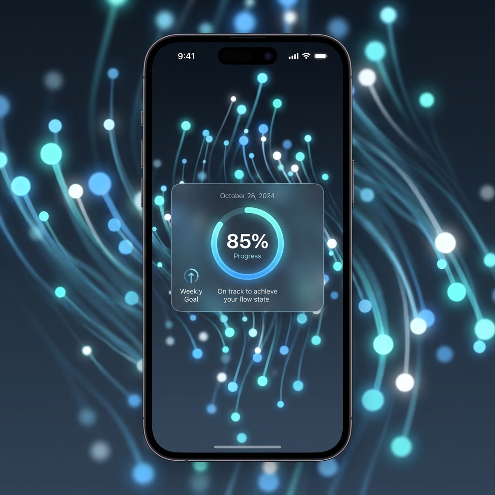
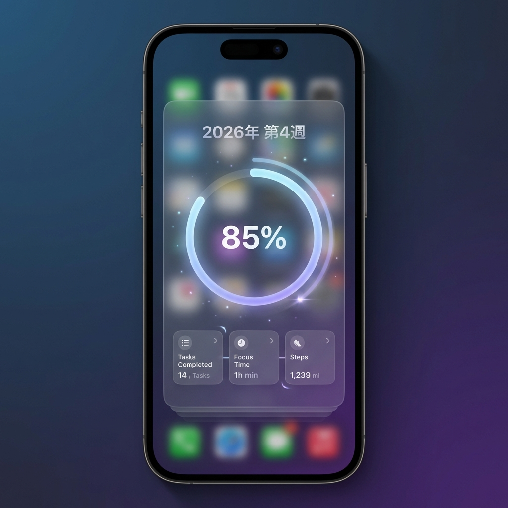

# 週回顧視覺化功能 (待開發)

> 📅 **狀態**: 規劃中 | **優先級**: P1 | **預估工時**: 12-19 小時

## 🎨 UI 效果圖



<!-- slide -->



<!-- slide -->



<!-- slide -->



<!-- slide -->



## ✨ 動畫效果演示



<!-- slide -->



<!-- slide -->


<!-- slide -->



<!-- slide -->



<!-- slide -->



## 📋 功能概述

類似 Apple 照片 App 的「回憶」功能和 Apple Music 的視覺化效果，自動生成每週的學習進度視覺回顧卡片。

### 核心靈感來源

- 📸 **照片 App**: 自動生成精美的週回顧卡片，展示本週努力軌跡
- 🎵 **音樂視覺化**: 使用動態動畫、漸層背景、粒子效果呈現數據
- 🏆 **成就系統**: 根據表現解鎖徽章，增加成就感
- 🔔 **智能提醒**: 週末自動提醒查看本週成果

## ✨ 主要功能

### 1. 週進度卡片 (Weekly Memory Card)

**視覺特色**:

- 🎨 **動態背景**: 根據完成度自動生成漸層配色
  - 優秀 (90-100%): 青綠漸層
  - 良好 (70-89%): 藍色漸層
  - 加油 (50-69%): 橙黃漸層
  - 需努力 (0-49%): 紅橙漸層
- ✨ **粒子效果**: Canvas 繪製的動態光點背景
- 📊 **數據視覺化**:
  - 任務完成率圓環 (動畫進入)
  - 每日專注時間柱狀圖 (逐個柱子動畫)
  - 類別分布餅圖

**展示數據**:

- 週次標題 (如: "2026年 第4週")
- 完成任務數 / 總任務數
- 總專注時間 (分鐘)
- 完成番茄鐘數
- 每日專注分布 (週一到週日)
- 類別時間分布
- 本週解鎖的成就徽章

### 2. 成就系統 (Achievements)

**預設成就類型**:

- 🌟 **全力以赴**: 任務完成率達 100%
- 🧠 **專注達人**: 週專注時間超過 10 小時
- 📈 **連續進步**: 連續 3 週完成率上升
- ⚖️ **平衡發展**: 所有類別都有專注時間
- 🌅 **早起鳥兒**: 至少 3 天在早上 8 點前開始專注
- 🍅 **番茄鐘冠軍**: 完成 20 個以上番茄鐘
- 🔥 **每日戰士**: 至少 5 天都完成了任務

**徽章設計**:

- 圓形徽章，包含圖示和主題色
- 解鎖動畫：縮放 + 光暈效果
- 點擊顯示成就詳情 Sheet

### 3. 歷史回顧 (Historical View)

**交互方式**:

- 左右滑動切換不同週次
- 底部時間軸快速跳轉
- 頂部顯示週次和日期範圍

**數據管理**:

- 每週一自動生成上週回顧
- 持久化存儲至 UserDefaults
- 支持查看過去幾個月的記錄

### 4. 週末提醒 (Weekly Reminder)

**通知機制**:

- 預設時間：週日晚上 8:00 PM
- 通知內容：「本週表現如何？點擊查看你的週回顧 📊」
- 點擊通知自動跳轉到週回顧頁面
- 支持自定義提醒時間

## 🏗️ 技術架構

### 數據模型層

#### WeeklyMemory.swift (新建)

```swift
struct WeeklyMemory: Identifiable, Codable {
    var id: String
    var weekStartDate: Date  // 週一
    var weekEndDate: Date    // 週日

    // 統計數據
    var completedTasksCount: Int
    var totalTasksCount: Int
    var completionRate: Double
    var totalFocusMinutes: Int
    var completedPomodoros: Int

    // 詳細數據
    var dailyFocusMinutes: [Int]  // 7天
    var categoryDistribution: [String: Int]
    var moodRecords: [Mood]

    // 視覺與成就
    var visualTheme: VisualTheme
    var achievements: [Achievement]
}

struct Achievement: Identifiable, Codable {
    var id: String
    var title: String
    var description: String
    var icon: String
    var colorHex: String
    var unlockedDate: Date?
    var achievementType: AchievementType
}

struct VisualTheme: Codable {
    var primaryColorHex: String
    var secondaryColorHex: String
    var gradientColors: [String]
    var themeName: String
}
```

### ViewModel 層

#### TaskViewModel.swift (擴展)

**新增屬性**:

```swift
@Published var weeklyMemories: [WeeklyMemory] = []
@Published var currentWeekMemory: WeeklyMemory?
```

**新增方法**:

- `generateWeeklyMemory(for date: Date) -> WeeklyMemory`
  - 計算任務統計、專注統計、類別分布
  - 檢測並解鎖成就
  - 生成視覺主題
- `checkAndUnlockAchievements(for memory: WeeklyMemory) -> [Achievement]`
- `saveWeeklyMemory()` / `loadWeeklyMemories()`
- `scheduleWeeklyReviewNotification()`

### 視圖層

#### 主頁面

- **WeeklyMemoriesView.swift** (新建)
  - 頂部導航欄（週次標題）
  - 主卡片區（TabView 支持滑動）
  - 底部時間軸（可選）

#### 組件

- **WeeklyMemoryCard.swift** (新建)
  - 動態背景 + 粒子效果
  - 數據視覺化區域
  - 成就徽章牆
- **AnimatedProgressRing.swift** (新建)
  - 可重用的動畫進度環
  - 支持漸層色填充
  - 進入動畫效果

- **ParticleEffectView.swift** (新建)
  - Canvas + TimelineView 實現
  - 星空/光點飄動效果
  - 性能優化（限制 50-100 個粒子）

- **AchievementBadge.swift** (新建)
  - 圓形徽章 UI
  - 解鎖動畫
  - 點擊顯示詳情

#### 整合

- **MeView.swift** (修改)
  - 添加「週回顧」導航項
  - 圖示：`calendar.badge.clock`

## 🎨 動畫設計

### 進度環動畫

```swift
Circle()
    .trim(from: 0, to: animatedProgress)
    .stroke(gradient, lineWidth: 12)
    .animation(.easeInOut(duration: 1.2), value: animatedProgress)
```

### 柱狀圖動畫

```swift
.frame(height: barHeight)
.animation(.spring(duration: 0.8).delay(Double(index) * 0.1), value: data)
```

### 粒子效果

```swift
TimelineView(.animation) { timeline in
    Canvas { context, size in
        for particle in particles {
            // 更新位置並繪製
        }
    }
}
```

## 📦 數據持久化

- **儲存位置**: UserDefaults
- **Key**: `"weeklyMemories"`
- **格式**: JSON (Codable)
- **自動生成**: 每週一早上自動為上週生成回顧

## 🔔 通知排程

- **觸發時間**: 每週日晚上 8:00 PM
- **重複**: 每週重複
- **實現**: `UNCalendarNotificationTrigger`
- **通知內容**:
  - 標題: "週回顧已就緒"
  - 內容: "本週表現如何？點擊查看你的週回顧 📊"
  - 點擊動作: 打開 App 並導航到 WeeklyMemoriesView

## ✅ 驗證計劃

### 功能測試

1. 數據生成正確性（任務、專注、成就）
2. 歷史週次切換流暢度
3. 成就解鎖邏輯準確性
4. 數據持久化（重啟後仍存在）

### UI/UX 測試

1. 動畫流暢性（60 fps）
2. 不同數據下的視覺效果
3. 邊界情況處理（無數據、極端值）
4. 深色外觀兼容性

### 性能測試

1. 粒子動畫不導致幀率下降
2. 記憶體使用正常
3. 大量歷史數據載入速度

### 通知測試

1. 週日提醒正確觸發
2. 通知權限處理
3. 點擊通知跳轉正確

## 🚀 開發步驟

### 階段一: 數據模型 (2 小時)

- [ ] 創建 `WeeklyMemory.swift`
- [ ] 定義 `Achievement` 結構
- [ ] 定義 `VisualTheme` 結構

### 階段二: ViewModel 擴展 (3 小時)

- [ ] 添加 `weeklyMemories` 屬性
- [ ] 實作 `generateWeeklyMemory()`
- [ ] 實作成就檢測邏輯
- [ ] 實作數據持久化方法
- [ ] 實作通知排程

### 階段三: 基礎組件 (4 小時)

- [ ] 創建 `AnimatedProgressRing`
- [ ] 創建 `ParticleEffectView`
- [ ] 創建 `AchievementBadge`

### 階段四: 主視圖 (3 小時)

- [ ] 創建 `WeeklyMemoryCard`
- [ ] 創建 `WeeklyMemoriesView`
- [ ] 整合所有組件

### 階段五: 整合與測試 (3 小時)

- [ ] 在 `MeView` 添加導航
- [ ] 功能測試
- [ ] 性能優化
- [ ] 通知測試

### 階段六: 文檔與交付 (2 小時)

- [ ] 更新專案文檔
- [ ] 創建使用說明
- [ ] 代碼審查

## 💡 未來擴展

### 可選功能

- 📤 **分享功能**: 將週回顧導出為圖片分享到社交媒體
- 📊 **月度報告**: 自動生成每月總結
- 🎯 **目標設定**: 設定下週目標，與實際表現對比
- 🌙 **深色粒子**: 深色模式下切換粒子顏色
- 🎵 **音效**: 解鎖成就時播放音效
- 📈 **趨勢分析**: 多週數據對比圖表

### 成就擴展

- 連續週數成就（連續 4 週、8 週、12 週）
- 總時數里程碑（累計 100 小時、500 小時）
- 特殊日期成就（生日週、考試週表現優異）

## 🎯 設計目標

1. **視覺震撼**: 第一眼就能吸引用戶注意
2. **數據清晰**: 關鍵指標一目了然
3. **動畫流暢**: 所有動畫保持 60 fps
4. **情感連結**: 透過成就和視覺主題建立成就感
5. **輕量高效**: 不影響 App 整體性能

---

**最後更新**: 2026-01-25  
**文檔作者**: AI Assistant  
**參考資料**: [implementation_plan.md](file:///Users/hungwei/.gemini/antigravity/brain/f4f572d5-3d49-45c6-9b6f-c3a61f0f9d81/implementation_plan.md)
