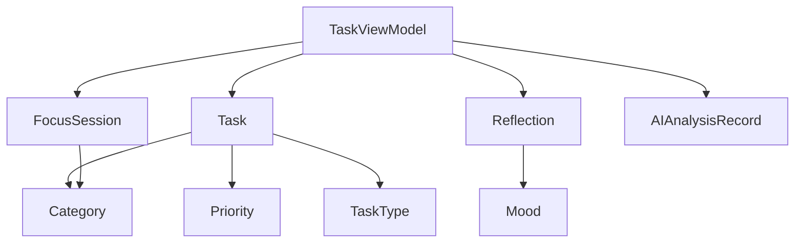

# 數據模型文檔 (Models)

## 📋 概述

本文檔詳細說明 TaskFlow 應用中的所有數據模型，包括任務、反思記錄、專注會話等核心數據結構。

---

## 🗂️ TaskModel.swift

位置: `/Models/TaskModel.swift`

### 核心模型

#### 1. Task (任務)

**用途**: 表示一個待辦任務或學習項目

```swift
struct Task: Identifiable, Codable {
    let id: String              // UUID
    var title: String           // 任務標題
    var completed: Bool         // 完成狀態
    var category: Category      // 類別 (國文、數學、英文)
    var priority: Priority      // 優先級 (普通、急迫)
    var type: TaskType          // 類型 (學業、生活、其他)
    var dueDate: Date          // 截止日期
}
```

**示例**:

```swift
let task = Task(
    id: UUID().uuidString,
    title: "數學習題 P.20-25",
    completed: false,
    category: .math,
    priority: .urgent,
    type: .academic,
    dueDate: Date()
)
```

**使用場景**:

- TaskListView: 顯示在 Kanban 看板中
- TaskCardView: 渲染為任務卡片
- TaskViewModel: 管理任務列表的增刪改查

---

#### 2. Category (類別)

**用途**: 定義任務的學科分類

```swift
enum Category: String, CaseIterable, Codable, Identifiable {
    case chinese = "國文"
    case math = "數學"
    case english = "英文"
    case other = "其他"

    var id: String { self.rawValue }

    // 背景色
    var backgroundColor: Color

    // 前景色
    var foregroundColor: Color

    // 圖示
    var icon: String
}
```

**顏色映射**:

- **國文**: 橙色 (#FF9F0A) - 溫暖、人文
- **數學**: 科技藍 (#007AFF) - 理性、邏輯
- **英文**: 綠色 (#30D158) - 清新、國際化
- **其他**: 灰色 - 中性

**圖示映射**:

- `book.fill` - 國文
- `function` - 數學
- `text.book.closed.fill` - 英文
- `folder.fill` - 其他

---

#### 3. Priority (優先級)

**用途**: 標記任務的緊急程度

```swift
enum Priority: String, Codable, CaseIterable {
    case normal = "普通"
    case urgent = "急迫"
}
```

**UI 表現**:

- `normal`: 無特殊標記
- `urgent`: 顯示紅色"急"標籤

---

#### 4. TaskType (任務類型)

**用途**: 區分任務的性質

```swift
enum TaskType: String, CaseIterable, Codable, Identifiable {
    case academic = "學業"
    case life = "生活"
    case other = "其他"

    var id: String { self.rawValue }

    var icon: String {
        switch self {
        case .academic: return "book.closed"
        case .life: return "house"
        case .other: return "ellipsis.circle"
        }
    }
}
```

---

#### 5. Reflection (每日反思)

**用途**: 記錄每天的心情、完成度和想法

```swift
struct Reflection: Identifiable, Codable {
    let id: String                    // UUID
    let date: Date                    // 日期
    var mood: Mood                    // 心情
    var completionLevel: Int          // 完成度 (0-100)
    var thoughts: String              // 想法/筆記
    var aiAnalysis: String?           // AI 分析結果 (可選)
}
```

**示例**:

```swift
let reflection = Reflection(
    id: UUID().uuidString,
    date: Date(),
    mood: .happy,
    completionLevel: 80,
    thoughts: "今天專注度很高，完成了數學作業",
    aiAnalysis: "您今天表現出色..."
)
```

---

#### 6. Mood (心情)

**用途**: 表示每日心情狀態

```swift
enum Mood: String, Codable, CaseIterable {
    case happy = "😊 開心"
    case neutral = "😐 普通"
    case sad = "😔 沮喪"
    case stressed = "😰 壓力大"
}
```

**使用場景**:

- ReflectView: 心情選擇器
- ReviewView: 心情趨勢圖表

---

#### 7. FocusSession (專注會話)

**用途**: 記錄每次番茄鐘專注會話的詳細信息

```swift
struct FocusSession: Identifiable, Codable {
    let id: String                    // UUID
    let category: Category            // 專注科目
    let duration: TimeInterval        // 專注時長 (秒)
    let date: Date                    // 開始時間
    var completed: Bool               // 是否完成
}
```

**示例**:

```swift
let session = FocusSession(
    id: UUID().uuidString,
    category: .math,
    duration: 1500,      // 25分鐘 = 1500秒
    date: Date(),
    completed: true
)
```

**數據統計**:

```swift
// 計算今日總專注時間
let todayDuration = sessions
    .filter { Calendar.current.isDateInToday($0.date) }
    .reduce(0) { $0 + $1.duration }

// 計算完成的會話數
let completedCount = sessions.filter { $0.completed }.count
```

---

#### 8. Day (星期枚舉)

**用途**: 表示星期幾，用於週計劃

```swift
enum Day: String, CaseIterable, Codable {
    case monday = "週一"
    case tuesday = "週二"
    case wednesday = "週三"
    case thursday = "週四"
    case friday = "週五"
    case saturday = "週六"
    case sunday = "週日"
}
```

**使用場景**:

- WeeklyScheduleView: 週計劃顯示
- 任務按星期分組

---

#### 9. FocusStatus (專注狀態)

**用途**: 表示番茄鐘計時器的當前狀態

```swift
enum FocusStatus: String, Codable {
    case idle = "待機"
    case focusing = "專注中"
    case break_ = "休息中"
    case paused = "暫停"
}
```

**狀態轉換**:

```
idle → focusing → break_ → focusing → idle
       ↓                    ↑
     paused ← → → → → → → →
```

**使用場景**:

- PomodoroView: 控制計時器行為
- 背景通知提醒
- UI 顯示不同狀態

---

#### 10. AIAnalysisRecord (AI 分析記錄)

**用途**: 保存 AI 生成的週報記錄

```swift
struct AIAnalysisRecord: Codable, Identifiable {
    let id: String          // UUID
    let date: Date         // 生成日期
    let content: String    // AI 分析內容 (Markdown)
}
```

**內容格式**:

```
本週表現分析

完成任務率：80%
總專注時間：15小時
...

---

下週建議策略

1. 增加數學科目的專注時間
2. 保持當前的學習節奏
...
```

**使用場景**:

- AICoachView: 顯示最新週報
- 歷史記錄列表

---

#### 11. TimerWidgetAttributes (Live Activity 數據模型)

**用途**: 定義 Timer Widget Live Activity 的靜態和動態數據

**位置**: `/Models/TimerWidgetAttributes.swift`

```swift
@available(iOS 16.1, *)
public struct TimerWidgetAttributes: ActivityAttributes {
    // 靜態數據（創建時設定，之後不變）
    public var timerMode: String        // "番茄鐘", "倒計時", "正計時"
    public var categoryName: String     // 任務類別名稱
    public var targetEndTime: Date      // 目標結束時間

    // 動態數據（可更新）
    public struct ContentState: Codable, Hashable {
        public var isPaused: Bool       // 暫停狀態
        public var elapsedSeconds: Int  // 已經過秒數
        public var totalSeconds: Int    // 總秒數

        // 計算屬性
        public var progress: Double {   // 進度（0.0 ~ 1.0）
            guard totalSeconds > 0 else { return 0 }
            return min(Double(elapsedSeconds) / Double(totalSeconds), 1.0)
        }

        public var remainingSeconds: Int {  // 剩餘秒數
            max(totalSeconds - elapsedSeconds, 0)
        }
    }
}
```

**示例**:

```swift
// 創建 Live Activity
let attributes = TimerWidgetAttributes(
    timerMode: "番茄鐘",
    categoryName: "數學作業",
    targetEndTime: Date().addingTimeInterval(1500)
)

let initialState = TimerWidgetAttributes.ContentState(
    isPaused: false,
    elapsedSeconds: 0,
    totalSeconds: 1500
)

let activity = try Activity.request(
    attributes: attributes,
    content: ActivityContent(state: initialState, staleDate: nil),
    pushType: nil
)
```

**數據流程**:

1. **創建**: `TaskViewModel.startLiveActivity()` 創建 Live Activity
2. **更新**: `TaskViewModel.updateLiveActivity(isPaused:)` 更新暫停狀態
3. **結束**: `TaskViewModel.endLiveActivity()` 結束 Live Activity

**Target Membership**:

- ✅ task-creator (主應用)
- ✅ TimerWidgetExtension

**相關文檔**: [Widgets](widgets.md) | [ViewModels](viewmodels.md#taskviewmodel)

---

## 📊 數據關係圖



---

## 💾 持久化

所有模型都遵循 `Codable` 協議，使用 `UserDefaults` 進行持久化：

```swift
// 保存
if let encoded = try? JSONEncoder().encode(tasks) {
    UserDefaults.standard.set(encoded, forKey: "tasks")
}

// 讀取
if let data = UserDefaults.standard.data(forKey: "tasks"),
   let decoded = try? JSONDecoder().decode([Task].self, from: data) {
    tasks = decoded
}
```

---

## 🔄 未來擴展

### 計劃添加的模型

1. **Goal (目標)**

```swift
struct Goal: Identifiable, Codable {
    let id: String
    var title: String
    var deadline: Date
    var progress: Double
    var relatedTasks: [String]  // Task IDs
}
```

2. **Habit (習慣)**

```swift
struct Habit: Identifiable, Codable {
    let id: String
    var name: String
    var frequency: HabitFrequency
    var streak: Int
    var completionDates: [Date]
}
```

3. **Note (筆記)**

```swift
struct Note: Identifiable, Codable {
    let id: String
    var title: String
    var content: String
    var category: Category
    var tags: [String]
    var createdAt: Date
}
```

---

## 📝 最佳實踐

### 1. 使用工廠方法

```swift
extension Task {
    static func create(title: String, category: Category) -> Task {
        Task(
            id: UUID().uuidString,
            title: title,
            completed: false,
            category: category,
            priority: .normal,
            type: .academic,
            dueDate: Date()
        )
    }
}
```

### 2. 計算屬性

```swift
extension Task {
    var isOverdue: Bool {
        !completed && dueDate < Date()
    }

    var formattedDueDate: String {
        dueDate.formatted(.dateTime.month().day())
    }
}
```

### 3. 類型安全的 ID

```swift
// 避免字符串 ID 混淆
typealias TaskID = String
typealias SessionID = String

struct Task {
    let id: TaskID
    // ...
}
```

---

**相關文檔**: [ViewModels](viewmodels.md) | [Services](services.md) | [Architecture](architecture.md)
