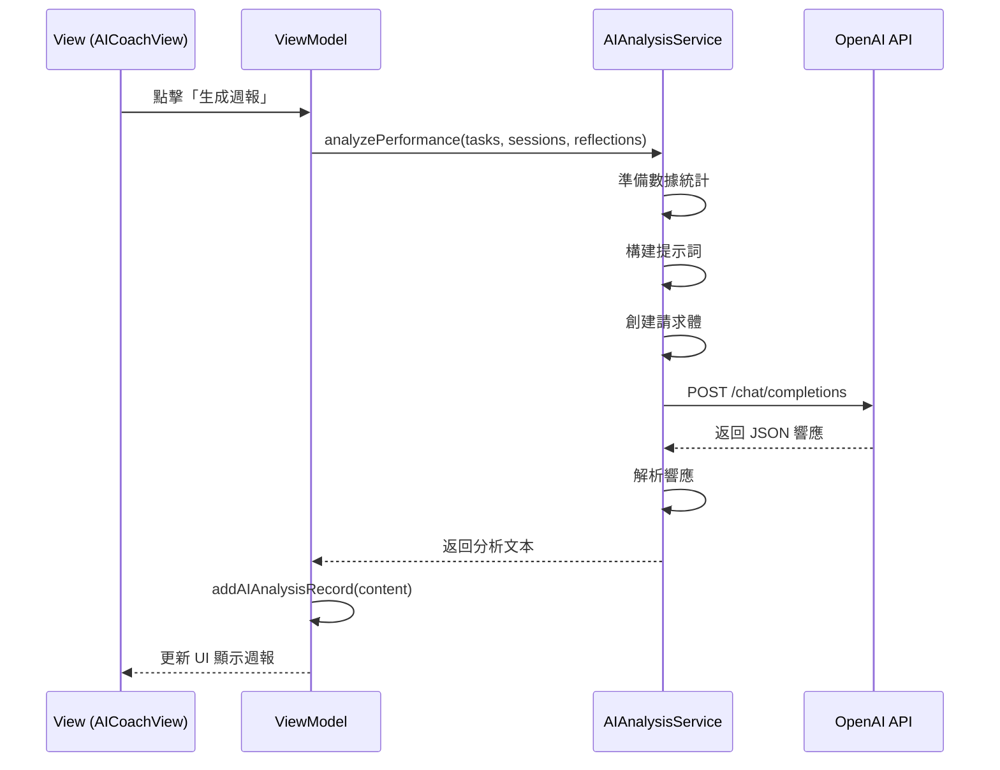

# 服務層文檔 (Services)

## 📋 概述

服務層負責處理外部 API 調用、網絡請求和複雜的業務邏輯。目前主要包含 AI 分析服務。

---

## 🤖 AIAnalysisService.swift

位置: `/Services/AIAnalysisService.swift`

### 類定義

```swift
class AIAnalysisService {
    static let shared = AIAnalysisService()
    
    private let apiKey = "YOUR_OPENAI_API_KEY"
    private let apiURL = "https://api.openai.com/v1/chat/completions"
    
    private init() {}
}
```

**設計模式**: 單例模式 (Singleton)

---

## 🎯 核心功能

### 1. 性能分析 (analyzePerformance)

#### 方法簽名
```swift
func analyzePerformance(
    tasks: [Task],
    focusSessions: [FocusSession],
    reflections: [Reflection]
) async throws -> String
```

#### 功能說明
分析用戶的學習數據並生成週報，包括：
- 任務完成率分析
- 專注時間統計
- 心情趨勢評估
- 下週改進建議

#### 數據準備
```swift
// 1. 計算任務完成情況
let completedTasks = tasks.filter { $0.completed }.count
let totalTasks = tasks.count
let completionRate = totalTasks > 0 ? 
    Double(completedTasks) / Double(totalTasks) * 100 : 0

// 2. 統計專注時間
let totalFocusTime = focusSessions.reduce(0) { $0 + $1.duration }
let completedSessions = focusSessions.filter { $0.completed }.count

// 3. 按類別統計
let mathTime = focusSessions
    .filter { $0.category == .math }
    .reduce(0) { $0 + $1.duration }
// 同理計算其他科目...

// 4. 心情分析
let moodDistribution = Dictionary(grouping: reflections) { $0.mood }
let avgCompletionLevel = reflections.isEmpty ? 0 :
    reflections.reduce(0) { $0 + $1.completionLevel } / reflections.count
```

#### 構建提示詞
```swift
let prompt = """
你是一位專業的學習教練，請根據以下數據分析學生本週的學習表現，並提供下週的改進建議。

【本週數據】
任務完成率：\(String(format: "%.1f", completionRate))%
總專注時間：\(totalFocusTime / 3600) 小時
完成的專注會話：\(completedSessions) 次
平均完成度：\(avgCompletionLevel)%

按科目專注時間：
- 數學：\(mathTime / 60) 分鐘
- 國文：\(chineseTime / 60) 分鐘
- 英文：\(englishTime / 60) 分鐘

心情分佈：
- 開心：\(happyCount) 天
- 普通：\(neutralCount) 天
- 沮喪：\(sadCount) 天
- 壓力大：\(stressedCount) 天

請用以下格式回覆（使用 Markdown）：

本週表現分析

(這裡寫 3-5 點具體的分析)

---

下週建議策略

(這裡寫 3-5 條具體可執行的建議)
"""
```

---

### 2. API 請求構建

#### 請求體結構
```swift
struct ChatRequest: Codable {
    let model: String
    let messages: [Message]
    let temperature: Double
    let max_tokens: Int
}

struct Message: Codable {
    let role: String     // "system" | "user"
    let content: String
}
```

#### 示例請求
```swift
let requestBody = ChatRequest(
    model: "gpt-4-turbo-preview",
    messages: [
        Message(
            role: "system",
            content: "你是一位專業的學習教練，擅長分析學習數據並提供建議。"
        ),
        Message(
            role: "user",
            content: prompt
        )
    ],
    temperature: 0.7,
    max_tokens: 1500
)
```

---

### 3. 網絡請求處理

#### 發送請求
```swift
// 1. 創建 URLRequest
var request = URLRequest(url: URL(string: apiURL)!)
request.httpMethod = "POST"
request.setValue("Bearer \(apiKey)", forHTTPHeaderField: "Authorization")
request.setValue("application/json", forHTTPHeaderField: "Content-Type")

// 2. 編碼請求體
let jsonData = try JSONEncoder().encode(requestBody)
request.httpBody = jsonData

// 3. 發送請求 (async/await)
let (data, response) = try await URLSession.shared.data(for: request)

// 4. 檢查 HTTP 狀態碼
guard let httpResponse = response as? HTTPURLResponse,
      httpResponse.statusCode == 200 else {
    throw AIAnalysisError.invalidResponse
}
```

---

### 4. 響應解析

#### 響應結構
```swift
struct ChatResponse: Codable {
    let id: String
    let object: String
    let created: Int
    let model: String
    let choices: [Choice]
    let usage: Usage
}

struct Choice: Codable {
    let index: Int
    let message: Message
    let finish_reason: String
}

struct Usage: Codable {
    let prompt_tokens: Int
    let completion_tokens: Int
    let total_tokens: Int
}
```

#### 提取內容
```swift
let chatResponse = try JSONDecoder().decode(ChatResponse.self, from: data)

guard let firstChoice = chatResponse.choices.first else {
    throw AIAnalysisError.emptyResponse
}

let analysisText = firstChoice.message.content
return analysisText
```

---

### 5. 錯誤處理

#### 自定義錯誤
```swift
enum AIAnalysisError: Error, LocalizedError {
    case invalidAPIKey
    case invalidResponse
    case emptyResponse
    case networkError(Error)
    case decodingError(Error)
    
    var errorDescription: String? {
        switch self {
        case .invalidAPIKey:
            return "API Key 無效或未設置"
        case .invalidResponse:
            return "伺服器響應無效"
        case .emptyResponse:
            return "AI 未返回任何內容"
        case .networkError(let error):
            return "網絡錯誤：\(error.localizedDescription)"
        case .decodingError(let error):
            return "解析錯誤：\(error.localizedDescription)"
        }
    }
}
```

#### 使用示例
```swift
do {
    let analysis = try await AIAnalysisService.shared.analyzePerformance(
        tasks: viewModel.tasks,
        focusSessions: viewModel.focusSessions,
        reflections: viewModel.reflections
    )
    print("分析結果：\(analysis)")
} catch let error as AIAnalysisError {
    print("AI 分析失敗：\(error.errorDescription ?? "未知錯誤")")
} catch {
    print("未知錯誤：\(error)")
}
```

---

## 📊 完整流程圖



---

## 💡 使用示例

### 在 View 中調用

```swift
struct AICoachView: View {
    @EnvironmentObject var viewModel: TaskViewModel
    @State private var isAnalyzing = false
    @State private var analysisResult = ""
    @State private var errorMessage = ""
    
    var body: some View {
        VStack {
            if isAnalyzing {
                ProgressView("AI 正在分析您的學習數據...")
            } else {
                Button("生成最新週報") {
                    generateReport()
                }
            }
            
            Text(analysisResult)
        }
    }
    
    func generateReport() {
        isAnalyzing = true
        errorMessage = ""
        
        Task {
            do {
                let result = try await AIAnalysisService.shared.analyzePerformance(
                    tasks: viewModel.tasks,
                    focusSessions: viewModel.focusSessions,
                    reflections: viewModel.reflections
                )
                
                await MainActor.run {
                    analysisResult = result
                    viewModel.addAIAnalysisRecord(content: result)
                    isAnalyzing = false
                }
            } catch {
                await MainActor.run {
                    errorMessage = error.localizedDescription
                    isAnalyzing = false
                }
            }
        }
    }
}
```

---

## 🔒 安全考慮

### 1. API Key 保護

**當前方式** (僅供開發):
```swift
private let apiKey = "sk-xxx..."  // ❌ 硬編碼
```

**推薦方式** (生產環境):

#### 選項 A: 使用環境變量
```swift
private let apiKey: String = {
    guard let key = ProcessInfo.processInfo.environment["OPENAI_API_KEY"] else {
        fatalError("OPENAI_API_KEY not set")
    }
    return key
}()
```

#### 選項 B: 使用 Keychain
```swift
import Security

private let apiKey: String = {
    let query: [String: Any] = [
        kSecClass as String: kSecClassGenericPassword,
        kSecAttrAccount as String: "openai_api_key",
        kSecReturnData as String: true
    ]
    
    var result: AnyObject?
    let status = SecItemCopyMatching(query as CFDictionary, &result)
    
    guard status == errSecSuccess,
          let data = result as? Data,
          let key = String(data: data, encoding: .utf8) else {
        fatalError("Failed to retrieve API key")
    }
    
    return key
}()
```

#### 選項 C: 後端代理
```swift
// 不在客戶端存儲 API Key
// 通過自己的後端服務轉發請求
private let apiURL = "https://your-backend.com/api/analyze"
```

---

### 2. 費用控制

```swift
// 添加請求限制
private var lastRequestTime: Date?
private let minimumRequestInterval: TimeInterval = 60  // 1分鐘

func analyzePerformance(...) async throws -> String {
    // 檢查請求頻率
    if let lastTime = lastRequestTime,
       Date().timeIntervalSince(lastTime) < minimumRequestInterval {
        throw AIAnalysisError.rateLimitExceeded
    }
    
    // 執行請求...
    lastRequestTime = Date()
    
    // ...
}
```

---

## 🎨 響應格式化

### Markdown 解析

AI 返回的內容是 Markdown 格式，可以使用以下方式渲染：

```swift
import MarkdownUI  // 第三方庫

struct AnalysisView: View {
    let content: String
    
    var body: some View {
        Markdown(content)
            .markdownTheme(.gitHub)  // 使用 GitHub 樣式
    }
}
```

### 手動分割

```swift
extension String {
    func splitAnalysisContent() -> (analysis: String, strategy: String)? {
        let components = self.components(separatedBy: "---")
        guard components.count >= 2 else { return nil }
        
        let analysis = components[0]
            .replacingOccurrences(of: "本週表現分析", with: "")
            .trimmingCharacters(in: .whitespacesAndNewlines)
        
        let strategy = components[1]
            .replacingOccurrences(of: "下週建議策略", with: "")
            .trimmingCharacters(in: .whitespacesAndNewlines)
        
        return (analysis, strategy)
    }
}
```

---

## 🧪 測試

### Mock Service

```swift
class MockAIAnalysisService: AIAnalysisService {
    override func analyzePerformance(
        tasks: [Task],
        focusSessions: [FocusSession],
        reflections: [Reflection]
    ) async throws -> String {
        // 模擬延遲
        try await Task.sleep(nanoseconds: 2_000_000_000)  // 2秒
        
        // 返回假數據
        return """
        本週表現分析
        
        1. 任務完成率達到 85%，表現優異
        2. 專注時間充足，共計 15 小時
        3. 心情穩定，保持積極
        
        ---
        
        下週建議策略
        
        1. 增加數學科目的練習時間
        2. 保持當前的專注節奏
        3. 適當安排休息時間
        """
    }
}
```

### 單元測試

```swift
import XCTest

class AIAnalysisServiceTests: XCTestCase {
    func testAnalysisWithEmptyData() async {
        let service = AIAnalysisService.shared
        
        do {
            let result = try await service.analyzePerformance(
                tasks: [],
                focusSessions: [],
                reflections: []
            )
            XCTAssertFalse(result.isEmpty)
        } catch {
            XCTFail("Should not throw error: \(error)")
        }
    }
}
```

---

## 🚀 未來擴展

### 1. 語音分析
```swift
func analyzeSpeechInput(audioURL: URL) async throws -> String {
    // 使用 Whisper API 轉錄語音
    // 然後進行分析
}
```

### 2. 圖片分析
```swift
func analyzeStudyNotes(imageURL: URL) async throws -> String {
    // 使用 GPT-4 Vision 分析手寫筆記
}
```

### 3. 實時聊天
```swift
func chat(message: String, history: [Message]) async throws -> String {
    // 實現對話式 AI 教練
}
```

---

**相關文檔**: [Models](models.md) | [ViewModels](viewmodels.md) | [Views - Me](views-me.md)
