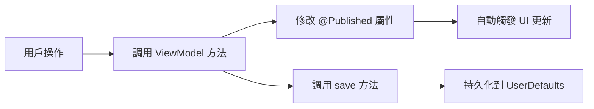

# 視圖模型文檔 (ViewModels)

## 📋 概述

TaskViewModel 是應用的核心狀態管理層，採用 MVVM 架構模式，負責管理所有業務邏輯和數據狀態。

---

## 🎯 TaskViewModel.swift

位置: `/ViewModels/TaskViewModel.swift`

### 類定義

```swift
class TaskViewModel: ObservableObject {
    // 發布的狀態屬性
    @Published var tasks: [Task] = []
    @Published var reflections: [Reflection] = []
    @Published var focusSessions: [FocusSession] = []
    @Published var aiAnalysisRecords: [AIAnalysisRecord] = []
    
    // 計時器狀態
    @Published var pomodoroTimeRemaining: TimeInterval = 1500  // 25分鐘
    @Published var pomodoroTotalTime: TimeInterval = 1500
    @Published var pomodoroIsRunning: Bool = false
    // ...
}
```

---

## 📝 核心功能

### 1. 任務管理 (Task Management)

#### 添加任務
```swift
func addTask(
    title: String,
    type: TaskType,
    category: Category,
    priority: Priority,
    dueDate: Date
) {
    let newTask = Task(
        id: UUID().uuidString,
        title: title,
        completed: false,
        category: category,
        priority: priority,
        type: type,
        dueDate: dueDate
    )
    tasks.append(newTask)
    saveTasks()
}
```

**使用場景**:
- TaskListView 的 FAB 按鈕
- CreateTaskSheet 表單提交

#### 刪除任務
```swift
func deleteTask(id: String) {
    tasks.removeAll { $0.id == id }
    saveTasks()
}
```

**特性**:
- 按 ID 精確刪除
- 自動保存到 UserDefaults
- 觸發 UI 更新 (@Published)

#### 更新任務
```swift
func updateTask(_ task: Task) {
    if let index = tasks.firstIndex(where: { $0.id == task.id }) {
        tasks[index] = task
        saveTasks()
    }
}
```

**使用場景**:
- TaskEditSheet 編輯表單
- TaskCardHomeView 修改任務

#### 切換完成狀態
```swift
func toggleCompletion(id: String) {
    if let index = tasks.firstIndex(where: { $0.id == id }) {
        tasks[index].completed.toggle()
        saveTasks()
    }
}
```

**UI 效果**:
- 卡片顯示綠色邊框
- 狀態徽章變為"已完成"
- 帶彈簧動畫

---

### 2. 反思管理 (Reflection Management)

#### 添加反思
```swift
func addReflection(
    mood: Mood,
    completionLevel: Int,
    thoughts: String
) {
    let reflection = Reflection(
        id: UUID().uuidString,
        date: Date(),
        mood: mood,
        completionLevel: completionLevel,
        thoughts: thoughts,
        aiAnalysis: nil
    )
    reflections.append(reflection)
    saveReflections()
}
```

#### 更新 AI 分析結果
```swift
func updateReflectionAnalysis(id: String, analysis: String) {
    if let index = reflections.firstIndex(where: { $0.id == id }) {
        reflections[index].aiAnalysis = analysis
        saveReflections()
    }
}
```

**使用場景**:
- ReflectView 獲取 AI 分析後回調

---

### 3. 專注會話管理 (Focus Session Management)

#### 添加專注會話
```swift
func addFocusSession(
    category: Category,
    duration: TimeInterval,
    completed: Bool
) {
    let session = FocusSession(
        id: UUID().uuidString,
        category: category,
        duration: duration,
        date: Date(),
        completed: completed
    )
    focusSessions.append(session)
    saveFocusSessions()
}
```

#### 獲取今日數據
```swift
var todayFocusSessions: [FocusSession] {
    focusSessions.filter { session in
        Calendar.current.isDateInToday(session.date)
    }
}

var todayFocusTime: TimeInterval {
    todayFocusSessions.reduce(0) { $0 + $1.duration }
}
```

**使用場景**:
- PomodoroView 顯示今日專注時間
- FocusAnalysisView 數據統計

#### 按類別統計
```swift
func focusTime(for category: Category, in sessions: [FocusSession]) -> TimeInterval {
    sessions
        .filter { $0.category == category }
        .reduce(0) { $0 + $1.duration }
}
```

---

### 4. 番茄鐘計時器狀態 (Pomodoro Timer State)

#### 計時器屬性
```swift
@Published var pomodoroTimeRemaining: TimeInterval = 1500     // 剩餘時間
@Published var pomodoroTotalTime: TimeInterval = 1500         // 總時間
@Published var pomodoroIsRunning: Bool = false                // 是否運行中
@Published var pomodoroSelectedMode: String = "專注"           // 當前模式
@Published var pomodoroSelectedCategory: Category = .chinese  // 專注科目
@Published var pomodoroTargetEndTime: Date? = nil            // 目標結束時間
```

#### 啟動計時器
```swift
func startPomodoro(mode: String, category: Category, duration: TimeInterval) {
    pomodoroSelectedMode = mode
    pomodoroSelectedCategory = category
    pomodoroTotalTime = duration
    pomodoroTimeRemaining = duration
    pomodoroIsRunning = true
    pomodoroTargetEndTime = Date().addingTimeInterval(duration)
    saveTimerState()
}
```

#### 停止計時器
```swift
func stopPomodoro(completed: Bool) {
    if completed && pomodoroTimeRemaining <= 0 {
        // 記錄完成的專注會話
        addFocusSession(
            category: pomodoroSelectedCategory,
            duration: pomodoroTotalTime,
            completed: true
        )
    }
    
    // 重置狀態
    pomodoroIsRunning = false
    pomodoroTargetEndTime = nil
    clearTimerState()
}
```

#### 背景恢復
```swift
func resumeTimerIfNeeded() {
    guard let endTime = pomodoroTargetEndTime,
          pomodoroIsRunning else { return }
    
    let now = Date()
    if now < endTime {
        pomodoroTimeRemaining = endTime.timeIntervalSince(now)
    } else {
        // 時間已到，觸發完成
        pomodoroTimeRemaining = 0
        stopPomodoro(completed: true)
    }
}
```

---

### 5. AI 分析記錄 (AI Analysis Records)

#### 添加記錄
```swift
func addAIAnalysisRecord(content: String) {
    let record = AIAnalysisRecord(
        id: UUID().uuidString,
        date: Date(),
        content: content
    )
    aiAnalysisRecords.append(record)
    saveAIAnalysisRecords()
}
```

#### 獲取最新週報
```swift
var latestWeeklyReport: AIAnalysisRecord? {
    aiAnalysisRecords
        .sorted { $0.date > $1.date }
        .first { record in
            Calendar.current.isDate(
                record.date,
                equalTo: Date(),
                toGranularity: .weekOfYear
            )
        }
}
```

---

## 💾 數據持久化

### UserDefaults Keys
```swift
private let tasksKey = "tasks"
private let reflectionsKey = "reflections"
private let focusSessionsKey = "focusSessions"
private let aiRecordsKey = "aiAnalysisRecords"
private let timerStateKey = "pomodoroTimerState"
```

### 保存方法
```swift
func saveTasks() {
    if let encoded = try? JSONEncoder().encode(tasks) {
        UserDefaults.standard.set(encoded, forKey: tasksKey)
    }
}

func loadTasks() {
    if let data = UserDefaults.standard.data(forKey: tasksKey),
       let decoded = try? JSONDecoder().decode([Task].self, from: data) {
        tasks = decoded
    }
}
```

### 初始化加載
```swift
init() {
    loadTasks()
    loadReflections()
    loadFocusSessions()
    loadAIAnalysisRecords()
    loadTimerState()
}
```

---

## 📊 數據統計方法

### 1. 任務統計
```swift
var completedTasksCount: Int {
    tasks.filter { $0.completed }.count
}

var totalTasksCount: Int {
    tasks.count
}

var completionRate: Double {
    guard totalTasksCount > 0 else { return 0 }
    return Double(completedTasksCount) / Double(totalTasksCount)
}
```

### 2. 按類別篩選
```swift
func tasks(for category: Category) -> [Task] {
    tasks.filter { $0.category == category }
}

func incompleteTasks(for category: Category) -> [Task] {
    tasks.filter { $0.category == category && !$0.completed }
}
```

### 3. 專注時間統計
```swift
// 本週總專注時間
var thisWeekFocusTime: TimeInterval {
    let calendar = Calendar.current
    let now = Date()
    
    return focusSessions
        .filter { session in
            calendar.isDate(session.date, equalTo: now, toGranularity: .weekOfYear)
        }
        .reduce(0) { $0 + $1.duration }
}

// 按科目統計本週時間
func thisWeekFocusTime(for category: Category) -> TimeInterval {
    let calendar = Calendar.current
    let now = Date()
    
    return focusSessions
        .filter { session in
            session.category == category &&
            calendar.isDate(session.date, equalTo: now, toGranularity: .weekOfYear)
        }
        .reduce(0) { $0 + $1.duration }
}
```

---

## 🔄 狀態更新流程



---

## 🎨 在 SwiftUI 中使用

### 注入 ViewModel
```swift
@main
struct TaskCreatorApp: App {
    @StateObject var viewModel = TaskViewModel()
    
    var body: some Scene {
        WindowGroup {
            ContentView()
                .environmentObject(viewModel)
        }
    }
}
```

### 在 View 中訪問
```swift
struct HomeView: View {
    @EnvironmentObject var viewModel: TaskViewModel
    
    var body: some View {
        Text("完成 \(viewModel.completedTasksCount)/\(viewModel.totalTasksCount)")
    }
}
```

### 修改狀態
```swift
Button("標記完成") {
    viewModel.toggleCompletion(id: task.id)
}
```

---

## 🧪 測試支持

### Mock Data
```swift
extension TaskViewModel {
    static var preview: TaskViewModel {
        let vm = TaskViewModel()
        vm.tasks = [
            Task.preview(title: "數學作業", category: .math),
            Task.preview(title: "英文單字", category: .english)
        ]
        return vm
    }
}
```

### Preview 使用
```swift
#Preview {
    HomeView()
        .environmentObject(TaskViewModel.preview)
}
```

---

## 🚀 性能優化

### 1. 避免過度保存
```swift
// ❌ 不好：每次修改都保存
func updateTaskTitle(_ id: String, _ title: String) {
    if let index = tasks.firstIndex(where: { $0.id == id }) {
        tasks[index].title = title
        saveTasks()  // 頻繁調用
    }
}

// ✅ 好：批量操作後統一保存
func updateTasks(_ updates: [(String, String)]) {
    for (id, title) in updates {
        if let index = tasks.firstIndex(where: { $0.id == id }) {
            tasks[index].title = title
        }
    }
    saveTasks()  // 只調用一次
}
```

### 2. 計算屬性緩存
```swift
// 對於複雜計算，考慮緩存
private var _cachedCompletionRate: Double?
var completionRate: Double {
    if let cached = _cachedCompletionRate {
        return cached
    }
    let rate = Double(completedTasksCount) / Double(totalTasksCount)
    _cachedCompletionRate = rate
    return rate
}

// 修改時清除緩存
func toggleCompletion(id: String) {
    // ...
    _cachedCompletionRate = nil
}
```

---

**相關文檔**: [Models](models.md) | [Services](services.md) | [Views](views-main.md)
