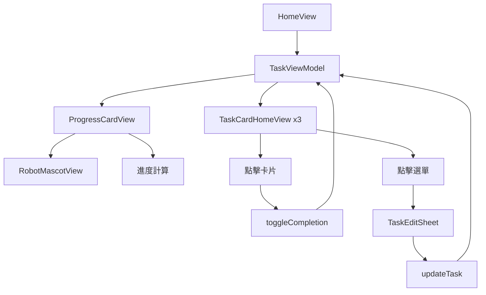

# 視圖文檔 - 首頁 (Home Views)

## 📋 概述

首頁視圖是用戶打開應用後看到的第一個界面，展示當日任務進度、可愛的機器人吉祥物，以及今日重點任務預覽。

---

## 🏠 HomeView.swift

位置: `/Views/Home/HomeView.swift`

### 功能說明

HomeView 是首頁的主視圖，整合了進度卡片、任務預覽和導航功能。

### 視圖結構

```swift
struct HomeView: View {
    @EnvironmentObject var viewModel: TaskViewModel
    @State private var opacity = 0.0
    @State private var showProfile = false
    
    var body: some View {
        ZStack {
            // 漸層背景
            LinearGradient(
                colors: [Color(hex: "5B7C99"), Color(hex: "34495E")],
                startPoint: .topLeading,
                endPoint: .bottomTrailing
            )
            
            ScrollView {
                VStack {
                    // Header
                    // ProgressCardView
                    // TaskCardHomeView (前3個任務)
                }
            }
        }
    }
}
```

### 主要組件

#### 1. 導航欄
```swift
HStack {
    VStack(alignment: .leading) {
        Text("嗨，未來的你 👋")
            .font(.title2)
            .fontWeight(.bold)
        Text("今天專注在哪些科目呢？")
            .font(.subheadline)
    }
    
    Spacer()
    
    // 頭像 + 通知點
    ZStack(alignment: .topTrailing) {
        Circle()
            .fill(LinearGradient(...))
            .frame(width: 44, height: 44)
        
        Circle()
            .fill(Color.red)
            .frame(width: 12, height: 12)
    }
    .onTapGesture { showProfile = true }
}
```

**特性**:
- 親切的問候語
- 彩色漸層頭像
- 紅色通知點提示
- 點擊彈出 ProfileView

#### 2. 動畫效果
```swift
.opacity(opacity)
.offset(y: opacity == 0 ? 20 : 0)
.onAppear {
    withAnimation(.easeOut(duration: 0.8)) {
        opacity = 1.0
    }
}
```

**效果**: 頁面淡入 + 向上滑動

---

## 📊 ProgressCardView.swift

位置: `/Views/Home/ProgressCardView.swift`

### 功能說明

動態進度卡片，根據任務完成度顯示不同顏色和鼓勵語，配有可愛的機器人吉祥物。

### 視圖結構

```swift
struct ProgressCardView: View {
    let completedTasks: Int
    let totalTasks: Int
    
    private var progress: Double {
        totalTasks == 0 ? 0 : Double(completedTasks) / Double(totalTasks)
    }
    
    private var progressState: ProgressState {
        // 根據進度返回狀態
    }
    
    var body: some View {
        ZStack {
            RoundedRectangle(cornerRadius: 24)
                .fill(Color(hex: "2C3E50"))
                .shadow(...)
            
            VStack {
                // 機器人 + 圓環進度
                // 線性進度條
            }
        }
    }
}
```

### 進度狀態系統

#### ProgressState Enum
```swift
enum ProgressState {
    case start       // 0-20%
    case step1       // 20-50%
    case halfway     // 50-80%
    case almost      // 80-100%
    case completed   // 100%
    
    var color: Color {
        switch self {
        case .start: return .blue
        case .step1: return .cyan
        case .halfway: return Color(hex: "30D158")  // Green
        case .almost: return Color(hex: "FF9F0A")   // Orange
        case .completed: return Color(hex: "FF453A") // Red/Pink
        }
    }
    
    var slogan: String {
        switch self {
        case .start: return "開始行動吧！💪"
        case .step1: return "踏出第一步了！🎯"
        case .halfway: return "已經完成一半！🎉"
        case .almost: return "最後衝刺！🔥"
        case .completed: return "太棒了！今日達成 ⭐️"
        }
    }
}
```

### 組件詳解

#### 1. 機器人吉祥物 (RobotMascotView)
```swift
struct RobotMascotView: View {
    let color: Color
    
    var body: some View {
        ZStack {
            // 身體 (圓角矩形)
            RoundedRectangle(cornerRadius: 20)
                .fill(color)
                .frame(width: 80, height: 80)
            
            // 天線
            ZStack {
                Rectangle().fill(color).frame(width: 4, height: 20)
                Circle().fill(.red).frame(width: 12, height: 12)
            }
            .offset(y: -50)
            
            // 手臂 (左右兩個)
            HStack(spacing: 80) {
                Capsule().fill(color).frame(width: 12, height: 40)
                    .rotationEffect(.degrees(-20))
                Capsule().fill(color).frame(width: 12, height: 40)
                    .rotationEffect(.degrees(20))
            }
            
            // 腿 (左右兩個)
            HStack(spacing: 20) {
                Capsule().fill(color).frame(width: 16, height: 30)
                Capsule().fill(color).frame(width: 16, height: 30)
            }
            .offset(y: 55)
            
            // 臉 (眼睛 + 嘴巴)
            VStack(spacing: 12) {
                HStack(spacing: 20) {
                    RobotEyeView()
                    RobotEyeView()
                }
                
                // 笑臉
                Path { path in
                    path.move(to: CGPoint(x: 0, y: 0))
                    path.addQuadCurve(
                        to: CGPoint(x: 30, y: 0),
                        control: CGPoint(x: 15, y: 8)
                    )
                }
                .stroke(Color.white, lineWidth: 3)
            }
        }
        .animation(.spring(), value: color)
    }
}
```

**特性**:
- 顏色隨進度變化
- Spring 動畫過渡
- 可愛的表情設計

#### 2. 語音氣泡
```swift
Text(progressState.slogan)
    .font(.caption)
    .fontWeight(.bold)
    .padding(...)
    .background(Color.white)
    .cornerRadius(12)
    .overlay(
        // 氣泡尾巴
        Path { path in
            path.move(to: CGPoint(x: 0, y: 10))
            path.addLine(to: CGPoint(x: -6, y: 15))
            path.addLine(to: CGPoint(x: 0, y: 20))
        }
        .fill(Color.white)
    )
    .rotationEffect(.degrees(-5))  // 輕微傾斜
    .animation(.spring().delay(0.2), value: progressState)
```

#### 3. 圓環進度
```swift
ZStack {
    // 背景環
    Circle()
        .stroke(Color.white.opacity(0.2), lineWidth: 8)
        .frame(width: 90, height: 90)
    
    // 進度環
    Circle()
        .trim(from: 0, to: progress)
        .stroke(progressState.color, style: StrokeStyle(lineWidth: 8, lineCap: .round))
        .rotationEffect(.degrees(-90))
        .animation(.spring(), value: progress)
    
    // 百分比文字
    VStack(spacing: 2) {
        Text("\(Int(progress * 100))%")
            .font(.title2)
            .fontWeight(.bold)
        Text("(\(completedTasks)/\(totalTasks))")
            .font(.caption2)
    }
}
```

#### 4. 線性進度條
```swift
GeometryReader { geo in
    ZStack(alignment: .leading) {
        // Track
        Capsule().fill(Color.white.opacity(0.2))
        
        // Indicator
        Capsule()
            .fill(progressState.color)
            .frame(width: max(8, geo.size.width * progress))
            .animation(.spring(), value: progress)
    }
}
.frame(height: 8)
```

---

## 📋 TaskCardHomeView.swift

位置: `/Views/Home/TaskCardHomeView.swift`

### 功能說明

首頁專用的任務卡片，顯示前3個任務的預覽，支持快速編輯和完成標記。

### 視圖結構

```swift
struct TaskCardHomeView: View {
    let task: Task
    @EnvironmentObject var viewModel: TaskViewModel
    @State private var showEditSheet = false
    @State private var showDeleteAlert = false
    
    var body: some View {
        ZStack {
            RoundedRectangle(cornerRadius: 16)
                .fill(Color(hex: "34495E"))
                .overlay(
                    RoundedRectangle(cornerRadius: 16)
                        .stroke(
                            task.completed ? Color(hex: "30D158") : Color.clear,
                            lineWidth: 2
                        )
                )
            
            VStack {
                // 類別標籤 + 選單
                // 任務標題
                // 進度條
                // 狀態徽章 + 日期
            }
        }
        .contentShape(Rectangle())
        .onTapGesture {
            viewModel.toggleCompletion(id: task.id)
        }
    }
}
```

### 主要組件

#### 1. 類別標籤
```swift
Text(task.category.rawValue)
    .font(.caption)
    .fontWeight(.bold)
    .foregroundColor(.black)
    .padding(.horizontal, 10)
    .padding(.vertical, 4)
    .background(categoryColor(for: task.category))
    .cornerRadius(6)
```

**顏色映射**:
- 國文: `#FF9F0A` (橙色)
- 數學: `#007AFF` (藍色)
- 英文: `#30D158` (綠色)

#### 2. 三點選單
```swift
Menu {
    Button {
        showEditSheet = true
    } label: {
        Label("編輯", systemImage: "pencil")
    }
    
    Button(role: .destructive) {
        showDeleteAlert = true
    } label: {
        Label("刪除", systemImage: "trash")
    }
} label: {
    Image(systemName: "ellipsis")
        .rotationEffect(.degrees(90))
}
```

#### 3. 進度條
```swift
GeometryReader { geo in
    ZStack(alignment: .leading) {
        Capsule().fill(Color.white.opacity(0.2))
        
        Capsule()
            .fill(Color(hex: "30D158"))
            .frame(width: geo.size.width * taskProgress)
            .animation(.spring(), value: taskProgress)
    }
}
.frame(height: 6)
```

#### 4. 完成徽章
```swift
if task.completed {
    HStack(spacing: 4) {
        Image(systemName: "checkmark.circle.fill")
            .font(.caption2)
        Text("已完成")
            .font(.caption)
    }
    .foregroundColor(Color(hex: "30D158"))
} else {
    HStack(spacing: 4) {
        Image(systemName: "circle")
        Text("待完成")
    }
    .foregroundColor(.white.opacity(0.5))
}
```

#### 5. 編輯表單 (TaskEditSheet)
```swift
struct TaskEditSheet: View {
    @Environment(\.dismiss) var dismiss
    let task: Task
    @State private var title: String
    @State private var selectedCategory: Category
    // ...
    
    var body: some View {
        NavigationView {
            Form {
                Section("任務資訊") {
                    TextField("任務標題", text: $title)
                    Picker("類別", selection: $selectedCategory) { ... }
                    Picker("類型", selection: $selectedType) { ... }
                    Picker("優先級", selection: $selectedPriority) { ... }
                    DatePicker("截止日期", selection: $dueDate)
                }
            }
            .navigationTitle("編輯任務")
            .toolbar {
                ToolbarItem(placement: .cancellationAction) {
                    Button("取消") { dismiss() }
                }
                ToolbarItem(placement: .confirmationAction) {
                    Button("儲存") {
                        saveChanges()
                        dismiss()
                    }
                }
            }
        }
    }
}
```

---

## 🎨 設計細節

### 顏色系統
```swift
// 主背景漸層
LinearGradient(
    colors: [Color(hex: "5B7C99"), Color(hex: "34495E")],
    startPoint: .topLeading,
    endPoint: .bottomTrailing
)

// 卡片背景
Color(hex: "2C3E50")  // 深藍灰
Color(hex: "34495E")  // 稍淺

// 文字
.white               // 標題
.white.opacity(0.7)  // 副標題
.white.opacity(0.5)  // 提示文字
```

### 間距規範
```swift
VStack(spacing: 24) {      // 主要區塊間距
    VStack(spacing: 12) {  // 卡片內間距
        HStack(spacing: 8) {  // 小組件間距
```

### 圓角半徑
```swift
.cornerRadius(24)  // 主卡片
.cornerRadius(16)  // 次級卡片
.cornerRadius(12)  // 氣泡、按鈕
.cornerRadius(6)   // 標籤
```

### 陰影效果
```swift
.shadow(color: Color.black.opacity(0.3), radius: 15, x: 0, y: 8)  // 主卡片
.shadow(color: Color.cyan.opacity(0.4), radius: 15, x: 0, y: 8)   // 發光效果
```

---

## 🔄 數據流



---

## 💡 使用技巧

### 1. 添加新的進度狀態
```swift
// 在 ProgressState enum 中添加
case superb  // 120%+ (有獎勵任務)

var color: Color {
    case .superb: return .purple
}

var slogan: String {
    case .superb: return "超越目標！你太棒了 🌟"
}
```

### 2. 自定義機器人動作
```swift
// 添加動畫效果
@State private var isJumping = false

RobotMascotView(color: progressState.color)
    .offset(y: isJumping ? -10 : 0)
    .animation(.spring(response: 0.3), value: isJumping)
    .onAppear {
        if progressState == .completed {
            withAnimation(.spring().repeatForever()) {
                isJumping = true
            }
        }
    }
```

### 3. 背景圖案
```swift
// 添加網格背景
ZStack {
    LinearGradient(...)
    
    // 網格圖案
    Canvas { context, size in
        let spacing: CGFloat = 40
        for x in stride(from: 0, to: size.width, by: spacing) {
            context.stroke(
                Path { path in
                    path.move(to: CGPoint(x: x, y: 0))
                    path.addLine(to: CGPoint(x: x, y: size.height))
                },
                with: .color(.white.opacity(0.05))
            )
        }
    }
}
```

---

**相關文檔**: [Views - Tasks](views-tasks.md) | [ViewModels](viewmodels.md) | [Models](models.md)
