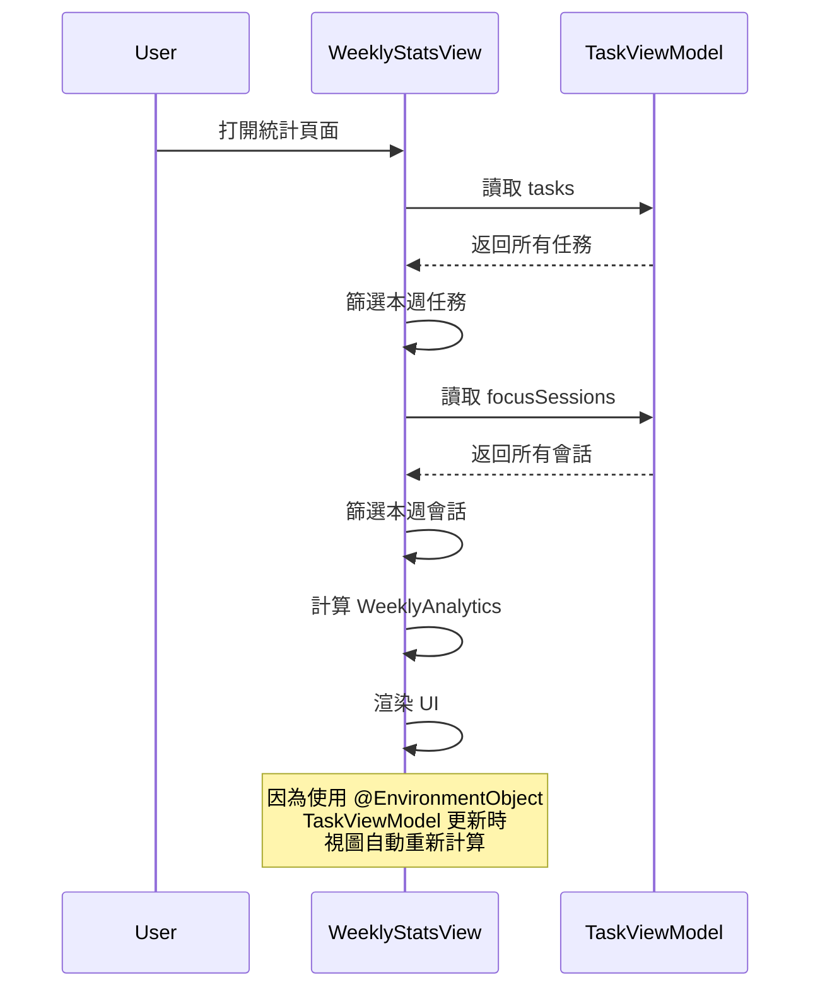

# 視圖文檔 - 個人中心 (Me Views)

## 📋 概述

個人中心包含 AI 週報、個人資料、每日反思和數據統計等功能，是用戶查看學習分析和進行自我反思的主要區域。

---

## 📊 WeeklyStatsView.swift

位置: `/Views/MePage/WeeklyStatsView.swift`

### 功能說明

本週統計視圖展示用戶本週的學習數據，包括任務完成率、專注時間分佈和番茄鐘完成數。**使用真實的 TaskViewModel 數據，非 Mock 測試數據。**

### 設計參考


### 視圖結構

```swift
struct WeeklyStatsView: View {
    @EnvironmentObject var viewModel: TaskViewModel
    
    private var weeklyData: WeeklyAnalytics {
        calculateWeeklyAnalytics()
    }
    
    var body: some View {
        ZStack {
            Color(hex: "1C2833").ignoresSafeArea()
            
            ScrollView {
                VStack(spacing: 20) {
                    WeeklyPerformanceCard(data: weeklyData)
                    FocusDataCard(data: weeklyData)
                }
            }
        }
    }
}
```

---

## 🔢 數據計算邏輯

### WeeklyAnalytics 數據模型

```swift
struct WeeklyAnalytics {
    let completedTasks: Int          // 完成的任務數
    let totalTasks: Int              // 總任務數
    let completionRate: Double       // 完成率 (0.0-1.0)
    let totalFocusMinutes: Int       // 總專注分鐘數
    let completedPomodoros: Int      // 完成的番茄鐘數
    let dailyFocusMinutes: [Int]     // 每日專注時間 [週一...週五]
}
```

### 真實數據計算

#### 1. 本週任務統計
```swift
func calculateWeeklyAnalytics() -> WeeklyAnalytics {
    let calendar = Calendar.current
    let now = Date()
    
    // 篩選本週任務
    let weeklyTasks = viewModel.tasks.filter { task in
        calendar.isDate(task.dueDate, equalTo: now, toGranularity: .weekOfYear)
    }
    
    let completedTasks = weeklyTasks.filter { $0.completed }.count
    let totalTasks = weeklyTasks.count
    let completionRate = totalTasks > 0 ? 
        Double(completedTasks) / Double(totalTasks) : 0
    
    // ...
}
```

**關鍵點**:
- 使用 `Calendar.isDate(_:equalTo:toGranularity:)` 判斷是否在同一週
- 避免硬編碼，動態計算當前週

#### 2. 專注會話統計
```swift
// 篩選本週專注會話
let weeklySessions = viewModel.focusSessions.filter { session in
    calendar.isDate(session.date, equalTo: now, toGranularity: .weekOfYear)
}

// 計算總專注時間（分鐘）
let totalFocusMinutes = Int(
    weeklySessions.reduce(0) { $0 + $1.duration } / 60
)

// 計算完成的番茄鐘數（至少20分鐘）
let completedPomodoros = weeklySessions.filter { 
    $0.completed && $0.duration >= 1200  // 20分鐘 = 1200秒
}.count
```

**番茄鐘判定條件**:
- `completed == true` (完整完成，未中途放棄)
- `duration >= 1200` (至少20分鐘)

#### 3. 每日專注時間分佈
```swift
var dailyFocusMinutes: [Int] = []

// 計算當前是週幾
let weekday = calendar.component(.weekday, from: now)
let daysFromMonday = (weekday == 1 ? 6 : weekday - 2)

// 遍歷週一到週五
for dayOffset in 0..<5 {
    let targetDate = calendar.date(
        byAdding: .day, 
        value: dayOffset - daysFromMonday, 
        to: now
    )!
    
    // 計算該天的專注時間
    let dayMinutes = Int(weeklySessions
        .filter { calendar.isDate($0.date, inSameDayAs: targetDate) }
        .reduce(0) { $0 + $1.duration } / 60)
    
    dailyFocusMinutes.append(dayMinutes)
}
```

**週一計算邏輯**:
- `weekday`: 1=週日, 2=週一, 3=週二, ..., 7=週六
- `daysFromMonday`: 當前日期距離週一的天數
- 通過 `byAdding: .day` 計算每一天的日期

---

## 🎨 UI 組件

### 1. 本週表現卡片 (WeeklyPerformanceCard)

#### 圓環進度
```swift
ZStack {
    // 背景環
    Circle()
        .stroke(Color.white.opacity(0.1), lineWidth: 12)
        .frame(width: 120, height: 120)
    
    // 漸層進度環
    Circle()
        .trim(from: 0, to: data.completionRate)
        .stroke(
            LinearGradient(
                colors: [Color(hex: "5DD3C6"), Color(hex: "4A90E2")],  // 青綠到藍
                startPoint: .topLeading,
                endPoint: .bottomTrailing
            ),
            style: StrokeStyle(lineWidth: 12, lineCap: .round)
        )
        .rotationEffect(.degrees(-90))
        .animation(.spring(duration: 1.0), value: data.completionRate)
    
    // 中央文字
    VStack(spacing: 4) {
        Text("\(Int(data.completionRate * 100))%")
            .font(.system(size: 32, weight: .bold, design: .rounded))
        Text("\(data.completedTasks)/\(data.totalTasks) Tasks")
            .font(.caption)
            .opacity(0.6)
    }
}
```

**設計細節**:
- 漸層色從青綠 (`#5DD3C6`) 到藍色 (`#4A90E2`)
- 線寬 12pt，圓角端點 (`.round`)
- Spring 動畫，持續 1 秒
- 圓環從 -90° 開始（12點鐘方向）

#### 完成度圖例
```swift
VStack(alignment: .leading, spacing: 16) {
    Text("總體任務完成度")
        .font(.subheadline)
        .opacity(0.7)
    
    // 完成任務
    HStack(spacing: 8) {
        Image(systemName: "checkmark.circle.fill")
            .foregroundColor(Color(hex: "5DD3C6"))  // 青綠色
        Text("完成任務")
    }
    
    // 待含任務
    HStack(spacing: 8) {
        Image(systemName: "exclamationmark.circle.fill")
            .foregroundColor(Color(hex: "FFB84D"))  // 橙色
        Text("待含任務")
    }
}
```

---

### 2. 專注數據卡片 (FocusDataCard)

#### 警告標籤
```swift
if data.totalFocusMinutes == 0 {
    HStack(spacing: 6) {
        Image(systemName: "exclamationmark.triangle.fill")
            .font(.caption)
        Text("未投入專注時間")
            .font(.caption)
    }
    .foregroundColor(Color(hex: "FF6B6B"))
    .padding(.horizontal, 12)
    .padding(.vertical, 6)
    .background(Color(hex: "FF6B6B").opacity(0.2))
    .cornerRadius(8)
}
```

**條件**:
- 僅在 `totalFocusMinutes == 0` 時顯示
- 紅色警告樣式 (`#FF6B6B`)

#### 柱狀圖
```swift
HStack(alignment: .bottom, spacing: 12) {
    ForEach(0..<5, id: \.self) { index in
        VStack(spacing: 8) {
            ZStack(alignment: .bottom) {
                // 背景柱（固定高度120）
                RoundedRectangle(cornerRadius: 4)
                    .fill(Color.white.opacity(0.1))
                    .frame(width: 50, height: 120)
                
                // 數據柱（動態高度）
                RoundedRectangle(cornerRadius: 4)
                    .fill(
                        LinearGradient(
                            colors: [Color(hex: "4A90E2"), Color(hex: "5DD3C6")],
                            startPoint: .bottom,
                            endPoint: .top
                        )
                    )
                    .frame(
                        width: 50,
                        height: calculateBarHeight(for: index)
                    )
                    .animation(
                        .spring(duration: 0.8, bounce: 0.3)
                            .delay(Double(index) * 0.1),
                        value: data.dailyFocusMinutes
                    )
            }
            
            // 星期標籤
            Text(["一", "二", "三", "四", "五"][index])
                .font(.caption)
                .opacity(0.5)
        }
    }
}
```

**高度計算**:
```swift
private var maxMinutes: Int {
    data.dailyFocusMinutes.max() ?? 100
}

func calculateBarHeight(for index: Int) -> CGFloat {
    guard maxMinutes > 0 else { return 0 }
    let ratio = CGFloat(data.dailyFocusMinutes[index]) / CGFloat(maxMinutes)
    return ratio * 120  // 最大120pt
}
```

**動畫效果**:
- Spring 彈簧動畫，持續 0.8 秒
- 彈性係數 0.3
- 每根柱子延遲 0.1 秒，形成波浪效果

#### 底部統計欄
```swift
HStack(spacing: 40) {
    // 左側：總專注時間
    VStack(alignment: .leading, spacing: 4) {
        Text("本週投入專注時間")
            .font(.caption)
            .opacity(0.6)
        
        Text("\(data.totalFocusMinutes)分鐘")
            .font(.title2)
            .fontWeight(.bold)
    }
    
    Spacer()
    
    // 右側：完成的番茄鐘
    VStack(alignment: .leading, spacing: 4) {
        Text("Completed Pomodoros")
            .font(.caption)
            .opacity(0.6)
        
        Text("\(data.completedPomodoros)")
            .font(.title2)
            .fontWeight(.bold)
    }
}
```

---

## 🎨 設計規範

### 顏色系統
```swift
// 背景
Color(hex: "1C2833")  // 深藍灰主背景
Color(hex: "2C3544")  // 卡片背景

// 漸層（進度環、柱狀圖）
LinearGradient(
    colors: [Color(hex: "5DD3C6"), Color(hex: "4A90E2")],  // 青綠→藍
    startPoint: .topLeading,
    endPoint: .bottomTrailing
)

// 狀態色
Color(hex: "5DD3C6")  // 完成（青綠）
Color(hex: "FFB84D")  // 待辦（橙色）
Color(hex: "FF6B6B")  // 警告（紅色）
```

### 間距與尺寸
```swift
// 卡片
.padding(24)                    // 內邊距
.cornerRadius(16)               // 圓角

// 柱狀圖
width: 50                       // 柱子寬度
height: 120                     // 最大高度
spacing: 12                     // 柱間距

// 圓環
width: 120, height: 120         // 圓環尺寸
lineWidth: 12                   // 線寬
```

### 字體
```swift
.font(.title3)                  // 卡片標題
.font(.system(size: 32, weight: .bold, design: .rounded))  // 百分比
.font(.caption)                 // 小標籤
.font(.title2)                  // 統計數字
```

---

## 🔗 集成到應用

### 在 MeView 中添加統計入口

```swift
struct MeView: View {
    var body: some View {
        // ...
        
        NavigationLink(destination: WeeklyStatsView()) {
            HStack {
                Image(systemName: "chart.bar.fill")
                Text("本週統計")
                Spacer()
                Image(systemName: "chevron.right")
            }
            .padding()
        }
    }
}
```

### 在 ReviewView 中嵌入

```swift
struct ReviewView: View {
    var body: some View {
        ScrollView {
            // 其他內容...
            
            // 嵌入週統計
            WeeklyStatsView()
                .frame(height: 500)
        }
    }
}
```

---

## 📊 數據更新流程



---

## 💡 使用技巧

### 1. 自定義時間範圍

```swift
// 將「本週」改為「本月」
let weeklyTasks = viewModel.tasks.filter { task in
    calendar.isDate(task.dueDate, equalTo: now, toGranularity: .month)  // 改為 .month
}
```

### 2. 添加趨勢箭頭

```swift
// 計算與上週的對比
func calculateTrend() -> Double {
    let lastWeekData = calculateAnalytics(for: calendar.date(byAdding: .weekOfYear, value: -1, to: Date())!)
    return data.completionRate - lastWeekData.completionRate
}

// 顯示
HStack {
    Text("\(Int(data.completionRate * 100))%")
    
    if calculateTrend() > 0 {
        Image(systemName: "arrow.up")
            .foregroundColor(.green)
    } else {
        Image(systemName: "arrow.down")
            .foregroundColor(.red)
    }
}
```

### 3. 導出數據為圖片

```swift
import SwiftUI

extension View {
    func snapshot() -> UIImage {
        let controller = UIHostingController(rootView: self)
        let view = controller.view
        
        let targetSize = controller.view.intrinsicContentSize
        view?.bounds = CGRect(origin: .zero, size: targetSize)
        view?.backgroundColor = .clear
        
        let renderer = UIGraphicsImageRenderer(size: targetSize)
        return renderer.image { _ in
            view?.drawHierarchy(in: controller.view.bounds, afterScreenUpdates: true)
        }
    }
}

// 使用
let image = WeeklyStatsView().snapshot()
```

---

## 🧪 測試數據

### 創建測試數據

```swift
extension TaskViewModel {
    func addTestWeeklyData() {
        let calendar = Calendar.current
        let now = Date()
        
        // 添加本週任務
        for i in 0..<5 {
            let task = Task(
                id: UUID().uuidString,
                title: "測試任務 \(i+1)",
                completed: i < 3,  // 前3個完成
                category: .math,
                priority: .normal,
                type: .academic,
                dueDate: now
            )
            tasks.append(task)
        }
        
        // 添加本週專注會話
        for dayOffset in 0..<5 {
            let sessionDate = calendar.date(byAdding: .day, value: dayOffset - 4, to: now)!
            
            let session = FocusSession(
                id: UUID().uuidString,
                category: .math,
                duration: Double((dayOffset + 1) * 600),  // 10-50分鐘
                date: sessionDate,
                completed: true
            )
            focusSessions.append(session)
        }
        
        saveTasks()
        saveFocusSessions()
    }
}
```

---

**相關文檔**: [ViewModels](viewmodels.md) | [Models](models.md) | [Views - Home](views-home.md)
